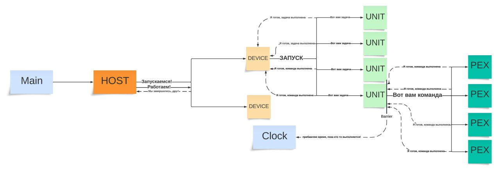

# LEVEL 1  
## Параметры для кластера

_Количество девайсов_: 1    
_Количество юнитов_: 1     
_Количество процессов_: 2

## Размер данных \(2^n\)

| **n** | **Время (time)** | **WG** | **TS** |
|-------|------------------|--------|--------|
| 2     | 16               | 4      | 2      |
| 3     | 73               | 4      | 2      |
| 4     | 353              | 4      | 2      |

_Количество девайсов_: 2    
_Количество юнитов_: 2     
_Количество процессов_: 4

## Размер данных \(2^n\)

| **n** | **Время (time)** | **WG** | **TS** |
|-------|------------------|--------|--------|
| 3     | 14               | 4      | 2      |
| 5     | 392               | 4      | 2      |

## Как работает код концептуально:   

## UML диаграмма команд и отношений между сущностями:  

# LEVEL 2:
Мы постарались изобразить упрощённый концепт взаимодействия Warp на SM. Он представлен на диаграмме:

Вот UML:   

